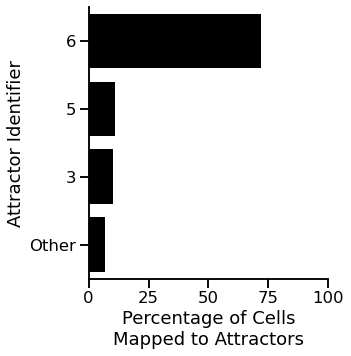
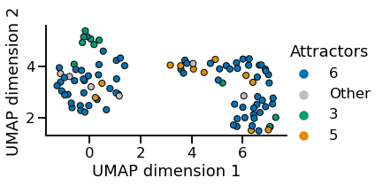
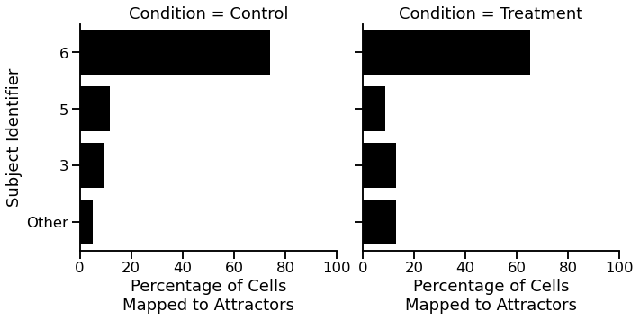
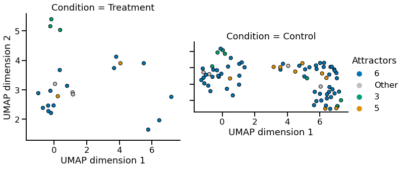
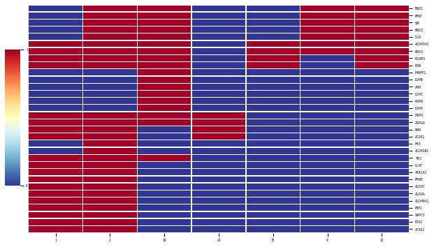
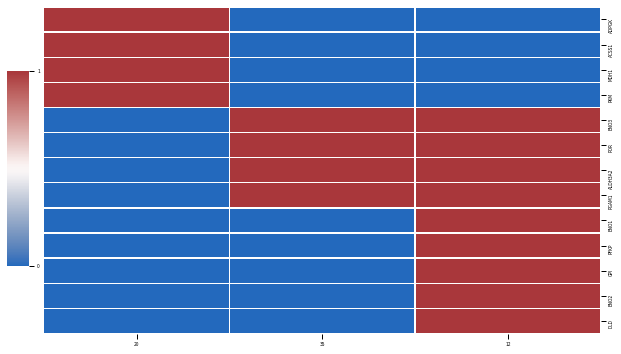

# <span style="color:red">Attractor analysis with scBONITA</span>

## <span style="color:blue">Step 0: You will need:</span>

- The results of an scBonita rule inference workflow for a single-cell dataset & at least one network
- A metadata file for your training data set


## <span style="color:blue">Step 1: import other pieces of scBonita and required Python packages</span>


```python
# import other pieces of scBonita
from singleCell import *
from ruleMaker import *
from testData import *

# import packages
import pickle, re, glob, os, copy, os.path, umap, random, requests, deap, gc
import pandas as pd, seaborn as sns, matplotlib.pyplot as plt, matplotlib.cm as cm, matplotlib.pyplot as plt, scipy.spatial.distance as ssd, networkx as nx, numpy as np, multiprocessing as mp
from os import path
from ast import literal_eval
from random import seed, sample
from time import sleep
from matplotlib.patches import Patch
from scipy.stats import ttest_ind, chi2_contingency
from statsmodels.stats.multitest import multipletests
from matplotlib.colors import ListedColormap, LinearSegmentedColormap
```

    /gpfs/fs2/scratch/mpalshik/scBONITA-main/scBonita_package/src/scBONITA/singleCell.py:1437: SyntaxWarning: "is not" with a literal. Did you mean "!="?
      if frequencyGrouping is not "":


# <span style="color:blue">Step 2: import the files you need</span>


```python
testData = scBonita_testData()  # test data set of 100 cells
# pickle.load(open("data/trainingData.csvscTest.pickle", "rb")).sampleList
```

### 2a: Import the metadata file and an 'embeddings' file that contains a PCA projection of the original training dataset (this is optional)


```python
metaData = testData["metaData"]  # pd.read_csv("conditions.txt", sep="\t", index_col=0)
embeddingData = testData[
    "embeddings"
]  # pd.read_csv("cell_embeddings.csv", index_col=0)
```

### 2b: Reconstruct the singleCell object generated by the rule inference pipeline


```python
scObject = testData[
    "scObject"
]  # objectFile = glob.glob("*.binscTest.pickle")#pickle.load(open(objectFile[0], "rb"))
scObject.sampleList
```


    ['Cell0',
     'Cell1',
     'Cell2',
     'Cell3',
     'Cell4',
     'Cell5',
     'Cell6',
     'Cell7',
     'Cell8',
     'Cell9',
     'Cell10',
     'Cell11',
     'Cell12',
     'Cell13',
     'Cell14',
     'Cell15',
     'Cell16',
     'Cell17',
     'Cell18',
     'Cell19',
     'Cell20',
     'Cell21',
     'Cell22',
     'Cell23',
     'Cell24',
     'Cell25',
     'Cell26',
     'Cell27',
     'Cell28',
     'Cell29',
     'Cell30',
     'Cell31',
     'Cell32',
     'Cell33',
     'Cell34',
     'Cell35',
     'Cell36',
     'Cell37',
     'Cell38',
     'Cell39',
     'Cell40',
     'Cell41',
     'Cell42',
     'Cell43',
     'Cell44',
     'Cell45',
     'Cell46',
     'Cell47',
     'Cell48',
     'Cell49',
     'Cell50',
     'Cell51',
     'Cell52',
     'Cell53',
     'Cell54',
     'Cell55',
     'Cell56',
     'Cell57',
     'Cell58',
     'Cell59',
     'Cell60',
     'Cell61',
     'Cell62',
     'Cell63',
     'Cell64',
     'Cell65',
     'Cell66',
     'Cell67',
     'Cell68',
     'Cell69',
     'Cell70',
     'Cell71',
     'Cell72',
     'Cell73',
     'Cell74',
     'Cell75',
     'Cell76',
     'Cell77',
     'Cell78',
     'Cell79',
     'Cell80',
     'Cell81',
     'Cell82',
     'Cell83',
     'Cell84',
     'Cell85',
     'Cell86',
     'Cell87',
     'Cell88',
     'Cell89',
     'Cell90',
     'Cell91',
     'Cell92',
     'Cell93',
     'Cell94',
     'Cell95',
     'Cell96',
     'Cell97',
     'Cell98',
     'Cell99']


### 2c: Get the list of network files for which you want to identify attractors


```python
currentDir = os.path.dirname(os.path.abspath("Attractor_Analysis_With_scBONITA.ipynb"))
networkList = [os.path.join(currentDir, "data", "hsa00010.graphml_processed.graphml")]
```

## <span style="color:blue">Step 3: Assign attractors - generate a dataframe of assigned attractors and an output file in the current working directory</span>


```python
distanceDF = scObject.assignAttractors(pathwayFiles=networkList)
# distanceDF = pd.read_csv("data/hsa00010.graphml_processed.graphml_attractorDistance.csv", index_col = 0)
```

## Step 4: Visualization and analysis

### 4a: Generate UMAP embedding for visualization (optional)


```python
reducer = umap.UMAP()
embedding = reducer.fit_transform(embeddingData.values)
plottingData = pd.DataFrame(
    embedding,
    columns=["UMAP dimension 1", "UMAP dimension 2"],
    index=embeddingData.index,
)
plottingData["Condition"] = [
    metaData.loc[temp, "Conditions"] for temp in plottingData.index
]
# plottingData["Sample"] = [
# metaData.loc[temp, "batchid"] for temp in plottingData.index
# ]
```


```python
plottingData.head()
```


<div>
<style scoped>
    .dataframe tbody tr th:only-of-type {
        vertical-align: middle;
    }

    .dataframe tbody tr th {
        vertical-align: top;
    }

    .dataframe thead th {
        text-align: right;
    }
</style>
<table border="1" class="dataframe">
  <thead>
    <tr style="text-align: right;">
      <th></th>
      <th>UMAP dimension 1</th>
      <th>UMAP dimension 2</th>
      <th>Condition</th>
    </tr>
  </thead>
  <tbody>
    <tr>
      <th>Cell0</th>
      <td>5.773878</td>
      <td>1.650911</td>
      <td>Treatment</td>
    </tr>
    <tr>
      <th>Cell1</th>
      <td>0.051125</td>
      <td>3.202106</td>
      <td>Treatment</td>
    </tr>
    <tr>
      <th>Cell2</th>
      <td>5.756959</td>
      <td>4.142223</td>
      <td>Control</td>
    </tr>
    <tr>
      <th>Cell3</th>
      <td>-1.194418</td>
      <td>3.950579</td>
      <td>Control</td>
    </tr>
    <tr>
      <th>Cell4</th>
      <td>-0.691290</td>
      <td>2.388059</td>
      <td>Treatment</td>
    </tr>
  </tbody>
</table>
</div>


### 4b: Make UMAP and attractor frequency plots

#### Make UMAP and attractor frequency plots without a faceting variable


```python
scObject.makeAttractorAnalysisPlots(
    plottingData,
    distanceDF,
    allAttractors=True,
    numberOfAttractorsToShow=2,
    cmap="colorblind",
    makeFrequencyPlots=True,
    freqplotsFile="freqPlots_test.pdf",
    makeUMAP=True,
    umapFile="umapPlots_test.pdf",
)
```

    [6, 5, 3]


    <Figure size 360x360 with 0 Axes>


    

    


    <Figure size 432x288 with 0 Axes>


    <Figure size 360x360 with 0 Axes>


    

    


    <Figure size 432x288 with 0 Axes>


#### Make UMAP and attractor frequency plots with a faceting variable


```python
scObject.makeAttractorAnalysisPlots(
    plottingData,
    distanceDF,
    allAttractors=True,
    numberOfAttractorsToShow=2,
    cmap="colorblind",
    makeFrequencyPlots=True,
    frequencyGrouping="Condition",
    freqplotsFile="freqPlots_test.pdf",
    makeUMAP=True,
    umapFile="umapPlots_test.pdf",
)
```

    [6, 5, 3]


    <Figure size 360x360 with 0 Axes>


    

    


    <Figure size 432x288 with 0 Axes>


    <Figure size 360x360 with 0 Axes>


    

    


    <Figure size 432x288 with 0 Axes>


### Make heatmaps of attractors

#### Show all identified attractors that map to cells in the training dataset


```python
scObject.makeAttractorHeatmaps(
    distanceDF=distanceDF,
    network="hsa00010.graphml",
    width=10,
    height=6,
    allAttractors=True,
)
```

    Attractor cell counts: 
    1 1
    2 2
    35 72
    9 3
    12 10
    19 1
    20 11


    <Figure size 720x432 with 0 Axes>


    

    


    (         1   2   9   12  19  20  35
     HK3       0   1   0   0   0   0   0
     PCK2      1   1   0   0   0   0   0
     ACSS2     1   1   0   0   0   0   0
     MDH1      1   1   0   0   1   1   0
     TPI1      1   1   0   0   1   0   0
     ENO2      0   1   1   1   1   0   0
     G6PC3     1   1   0   0   0   0   0
     PGM2      0   0   0   0   1   0   0
     FBP1      1   1   0   0   0   0   0
     ALDH3A2   1   1   1   1   1   0   1
     ALDH9A1   1   1   0   0   0   0   0
     PGAM1     1   1   0   1   1   0   1
     POR       1   1   0   1   1   0   1
     ALDH1B1   0   1   0   0   0   0   0
     ALDOA     1   1   0   0   0   0   0
     ALDOC     1   1   0   0   0   0   0
     PFKM      1   1   0   0   0   0   0
     AKR1A1    1   1   0   0   0   0   0
     PKM       1   1   0   0   0   1   0
     DLAT      1   1   0   0   0   0   0
     ACSS1     1   1   0   0   0   1   0
     ADPGK     1   1   0   0   1   1   0
     DLD       0   1   1   1   1   0   0
     GPI       0   1   1   1   1   0   0
     PFKP      0   1   1   1   1   0   0
     ENO1      0   1   1   1   1   0   0
     LDHA      0   0   0   0   1   0   0
     LDHC      0   0   0   0   1   0   0
     AHR       0   0   0   0   1   0   0
     LDHB      0   0   0   0   1   0   0
     MINPP1    0   0   0   0   1   0   0
     ENO3      1   1   1   1   1   0   1,
     <seaborn.matrix.ClusterGrid at 0x2af40b9110a0>)


    <Figure size 432x288 with 0 Axes>


#### Show only the top 3 attractors (ranked by the number of cells they map to)


```python
scObject.makeAttractorHeatmaps(
    distanceDF=distanceDF,
    network="hsa00010.graphml",
    width=10,
    height=6,
    allAttractors=False,
    numberOfAttractorsToShow=3,
    cmap="vlag",
)
```

    Attractor cell counts: 
    1 1
    2 2
    35 72
    9 3
    12 10
    19 1
    20 11


    <Figure size 720x432 with 0 Axes>


    

    


    (         1   2   9   12  19  20  35
     HK3       0   1   0   0   0   0   0
     PCK2      1   1   0   0   0   0   0
     ACSS2     1   1   0   0   0   0   0
     MDH1      1   1   0   0   1   1   0
     TPI1      1   1   0   0   1   0   0
     ENO2      0   1   1   1   1   0   0
     G6PC3     1   1   0   0   0   0   0
     PGM2      0   0   0   0   1   0   0
     FBP1      1   1   0   0   0   0   0
     ALDH3A2   1   1   1   1   1   0   1
     ALDH9A1   1   1   0   0   0   0   0
     PGAM1     1   1   0   1   1   0   1
     POR       1   1   0   1   1   0   1
     ALDH1B1   0   1   0   0   0   0   0
     ALDOA     1   1   0   0   0   0   0
     ALDOC     1   1   0   0   0   0   0
     PFKM      1   1   0   0   0   0   0
     AKR1A1    1   1   0   0   0   0   0
     PKM       1   1   0   0   0   1   0
     DLAT      1   1   0   0   0   0   0
     ACSS1     1   1   0   0   0   1   0
     ADPGK     1   1   0   0   1   1   0
     DLD       0   1   1   1   1   0   0
     GPI       0   1   1   1   1   0   0
     PFKP      0   1   1   1   1   0   0
     ENO1      0   1   1   1   1   0   0
     LDHA      0   0   0   0   1   0   0
     LDHC      0   0   0   0   1   0   0
     AHR       0   0   0   0   1   0   0
     LDHB      0   0   0   0   1   0   0
     MINPP1    0   0   0   0   1   0   0
     ENO3      1   1   1   1   1   0   1,
     <seaborn.matrix.ClusterGrid at 0x2af41d2087c0>)


    <Figure size 432x288 with 0 Axes>

